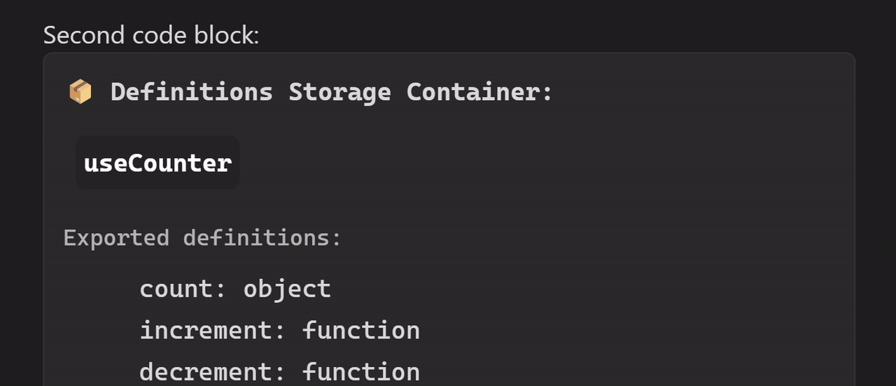
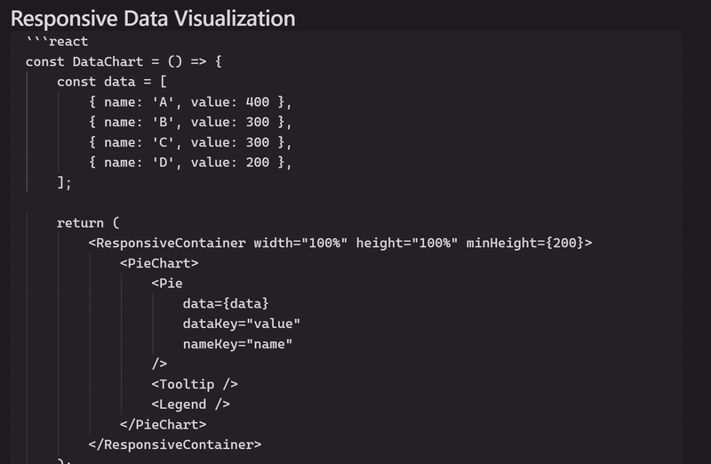
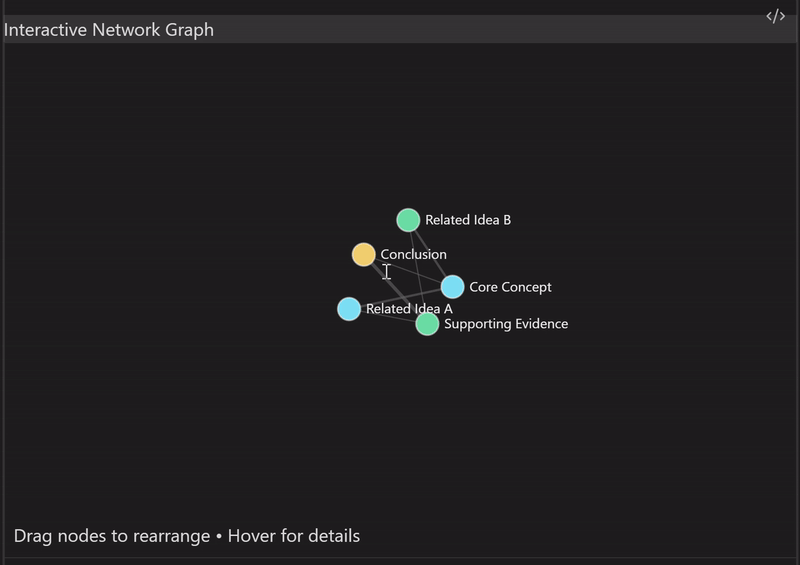
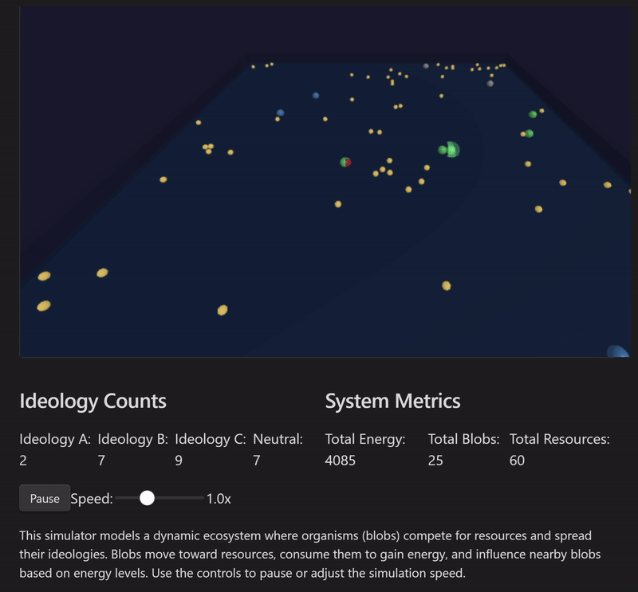
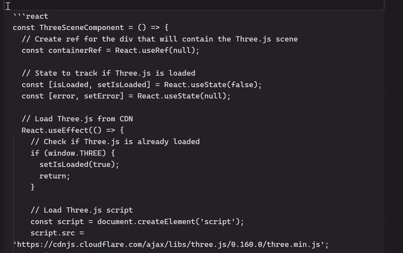
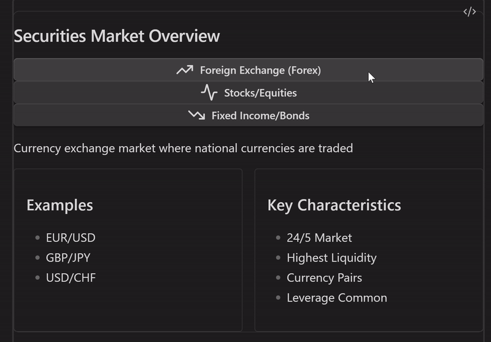

# ReactiveNotes - Dynamic React Components in Obsidian


[](https://opensource.org/licenses/MIT)

[](https://www.buymeacoffee.com/prodigist)

Transform your Obsidian vault into a reactive computational environment. ReactiveNotes seamlessly integrates React's component ecosystem with Obsidian's powerful note-taking capabilities, enabling dynamic, interactive documents that evolve with your thoughts.
> ⚠️ **Mobile Support**: Currently optimized for desktop use. Mobile support is under development.

## Why ReactiveNotes?

- **Native Integration**: Built from the ground up for Obsidian
- **Powerful Yet Simple**: Write React components directly in your notes
- **Dynamic & Interactive**: Turn static notes into living documents
- **Extensible Foundation**: Build your own tools and visualizations
## Compatibility
- Obsidian v1.4.0 or higher
- React v18.2.0


---

**New to ReactiveNotes? Start here!**

**[🎨 See it in Action! (Examples)](./docs/EXAMPLES/README.md)**: Explore a gallery of what you can build.

---
## 🚀 Quick Start

### Installation
1. Open Obsidian Settings → Community Plugins
2. Disable Safe Mode if necessary
3. Search for "ReactiveNotes"
4. Click Install and Enable

For manual installation:
1. Download release from GitHub
2. Extract to your vault's `.obsidian/plugins` folder
3. Enable in Community Plugins settings

### Basic Usage

Create a React component in any note:
````markdown
```react
const Greeting = () => {
    const [name, setName] = useState("World");
    return <h1>Hello, {name}!</h1>;
};

export default Greeting;
```
````

**Component Requirements:**
- Must be self-contained in one code block
- Component to Render must be the first component within codeblock

## 💻 Core Features

### 1. React Components in Notes
Build dynamic UIs directly in your notes with React 18 and TypeScript. Features robust error handling, lifecycle management, and real-time updates.

### 2. Canvas Manipulation
- HTML Canvas API support for custom drawing
- THREE.js integration for 3D graphics
- Lightweight Charts for financial visualization
- D3 force layout integration for network graphs
- Support for both 2D and 3D rendering contexts

### 3. State Management
Effortlessly manage component state with multiple options:
- **Persistent Note State**: Use the `useStorage` hook to save and load component data directly within your note's frontmatter. State travels with your note!
- **Cross-Note Persistence**: Extend `useStorage` to interact with the frontmatter of *other* notes in your vault.
- **Root Level Frontmatter**: Opt to store data at the root of the frontmatter, outside the default `react_data` section, for broader compatibility.
- **Standard React State**: Utilize `useState` and other React hooks for local, non-persistent component state.
- **Browser `localStorage`**: Access global, non-note-specific storage for preferences or shared data across all notes.\
For greater detail and examples.
➡️ **[Deep Dive into State Management](./docs/03_STATE_MANAGEMENT.md)**


### 4. File Reading Utility

The plugin provides a flexible file reading utility through the `readFile` function that helps you interactively select and read files from your vault.
```javascript
const fileData = await readFile( path,extensions);
```
### Parameters
- `path` (optional): Direct path to a specific file. If provided, skips the file selector. Default: `null`
- `extensions` (optional): Array of file extensions to filter by. Default: `['txt', 'md', 'json', 'csv']`

This utility is particularly useful for components that need to process files from your vault, such as data visualizations, document analysis, and custom importers.\
➡️ **[Read Files Usage and Examples](./docs/04_FILE_SYSTEM_ACCESS.md)**

### 5. CDN Library Support
Import additional libraries from cdnjs:
```javascript
import Chart from 'https://cdnjs.cloudflare.com/ajax/libs/Chart.js/4.4.0/chart.umd.min.js';
```

Requirements:
- HTTPS URLs from cdnjs.cloudflare.com only
- Imports must exist alone in their own line
- Browser-compatible libraries only

### 6. Theme Integration
```javascript
const theme = getTheme(); // Returns 'dark' or 'light' correspodning to obsidian theme

const styles = {
    background: theme === 'dark' ? 'var(--background-primary)' : 'white',
    color: theme === 'dark' ? 'var(--text-normal)' : 'black'
};
// Or use 'dark:' within your components
```

### 7. Vault Code Imports

Import React code from other notes in your vault:

```javascript
// Import code from another note
vaultImport('Components/SharedComponents.md', 0);  // 0 = first code block
vaultImport('Hooks/CustomHooks.md', 1);           // 1 = second code block

const MyComponent = () => {
    // Use imported components and hooks from these files
    const data = useImportedHook();
    return <ImportedComponent data={data} />;
};
```


### 8. Definition Storage Blocks

Not all react code blocks need to be valid React you can use React code blocks to store and organize utility functions, hooks, and other definitions:

```javascript
// This displays as a definition storage block instead of rendering
const utilities = () => ({
    formatDate: (date) => date.toLocaleDateString(),
    calculateSum: (arr) => arr.reduce((a, b) => a + b, 0),
    parseData: (raw) => JSON.parse(raw)
});

export default utilities;
```

When a code block returns an object instead of JSX, it automatically displays as a storage block showing all exported definitions. If you have multiple objects containing definitions only the first object will be previewed.
Perfect for:

Utility function collections
Custom hook libraries
Configuration objects
Shared constants

Import these definitions into other components using vaultImport().

### 9. LaTeX Math Rendering with MathJax 
- Display complex mathematical and scientific notations beautifully. 
- Supports standard LaTeX syntax within your React components. 
- Automatic rendering of inline ($...$) and display ($$...$$) math. 


## 📚  Available Libraries & Components

ReactiveNotes provides access to popular libraries and components directly in your notes:
### Core Libraries
```jsx
// React and hooks
import React, { useState, useEffect, useRef, useMemo } from 'react';

// Data visualization 
import { LineChart, BarChart, PieChart } from 'recharts';
import { createChart } from 'lightweight-charts';

// Data processing
import Papa from 'papaparse';  // CSV parsing
import * as XLSX from 'xlsx';  // Excel files
import * as mathjs from 'mathjs'; // Mathematics
import { format, parseISO } from 'date-fns'; // Date handling

// Interface components
import { Card, Tabs, Switch } from '@/components/ui';
import { TrendingUp, Activity, Settings } from 'lucide-react'; // 70+ icons
import * as LucideIcons from 'lucide-react'; // For complete access just use LucideIcons.IconName
```
Checkout the full [component reference](./COMPONENTS.md) for a complete list of available libraries, components and utilities.

If needed, libraries not provided within this list can be imported via CDN imports.

### Available in Component Scope
<details>
All components have access to these objects and functions:

```javascript
// Note context
noteContext.frontmatter  // All frontmatter properties (not just react_data)
noteContext.path         // Full path to current note
noteContext.basename     // Note filename without extension

// Utilities
getTheme()              // Returns 'dark' or 'light'
readFile(path, exts)    // File reading utility

// Update frontmatter properties, either in react_data (extProp:false) or at root level(extProp:true) Defaults to react_data
updateFrontmatter(key, value, notePath?, extProp?) 
// If properties are null returns entire frontmatter or current note if path not provided, extProp defaults to true: entire frontmatter
getFrontmatter(key?,defaultValue?,notePath?, extProp?)

vaultImport(path, index) // Preprocessor directive to include code from other notes (not a runtime function)
Notice(message, timeout?)  // Display non-blocking notifications (use instead of alert() which blocks the UI thread)
```
</details>


## 🎨 Component Examples

### Interactive Data Visualization
````
```react
const DataChart = () => {
    const data = [
        { month: 'Jan', value: 100 },
        { month: 'Feb', value: 150 },
        { month: 'Mar', value: 120 }
    ];

    return (
        <ResponsiveContainer width="100%" height={300}>
            <LineChart data={data}>
                <XAxis dataKey="month" />
                <YAxis />
                <Line type="monotone" dataKey="value" />
                <Tooltip />
            </LineChart>
        </ResponsiveContainer>
    );
};
```
````

### Canvas Manipulation
````
const DrawingCanvas = () => {
    const canvasRef = useRef(null);
    
    useEffect(() => {
        const ctx = canvasRef.current.getContext('2d');
        ctx.fillStyle = getTheme() === 'dark' ? '#fff' : '#000';
        
        // Your drawing code
        
        return () => {
            // Cleanup
        };
    }, []);

    return <canvas ref={canvasRef} className="w-full h-64" />;
};
````
### Persistent State Component
````
```react
const NoteTracker = () => {
    const [notes, setNotes] = useStorage('notes', []);
    
    const addNote = (text) => {
        setNotes(prev => [...prev, {
            id: Date.now(),
            text,
            created: new Date()
        }]);
    };
    
    return (
        <Card>
            <CardHeader>
                <CardTitle>My Notes</CardTitle>
            </CardHeader>
            <CardContent>
                {notes.map(note => (
                    <div key={note.id}>{note.text}</div>
                ))}
                <Button onClick={() => addNote("New Note")}>
                    Add Note
                </Button>
            </CardContent>
        </Card>
    );
};
```
````

### Network Visualization
````
```react
const NetworkGraph = () => {
    const [nodes] = useState([
        { id: 1, label: 'Node 1' },
        { id: 2, label: 'Node 2' }
    ]);
    
    const [links] = useState([
        { source: 1, target: 2 }
    ]);

    return (
        <ForceGraph
            graphData={{ nodes, links }}
            nodeAutoColorBy="label"
            nodeLabel="label"
        />
    );
};
```
````

### Other Demonstrated Examples
**Simulator** (Use within reason for performance)


**File Upload**


**3D Animation**


**Tabbed UI**


**Progression Dashboard**

Knowledge progression dashboard using persistant storage and ability to make new notes/categories


**Integrated use case with MCP**

 MCP fetches data from youtube and uses Reactive Notes to display react component for visualising fetched data.


**Games utilising event listeners for key action mapping**


## 🔧 Troubleshooting

### Common Issues
1. **Component not rendering**
   - Check console for React errors
   - Validate JSX syntax

2. **CDN imports not working**
   - Verify HTTPS URL
   - Check library compatibility
   - Confirm import syntax

3. **State persistence issues**
   - Verify storage key uniqueness
   - Validate data serialization
   - Monitor storage size limits

4. **Performance Problems**
   - Use React DevTools for profiling
   - Implement proper cleanup in useEffect
   - Optimize re-renders with useMemo/useCallback
   - Monitor memory usage with large datasets
Having issues or have questions?
Bring them to my attention by creating an issue.

### Security Considerations
- CDN imports are restricted to cdnjs.cloudflare.com
- File system access is limited to vault
- Component code runs in sandbox
- No external network requests

## Limitations

1. **Environment Constraints**
   - CDN imports limited to cdnjs.cloudflare.com

2. **Performance Considerations**
   - Large datasets may impact performance
   - Heavy animations should be optimized
   - Memory usage needs monitoring
   - Mobile performance varies

3. **Work in Progress**
   - Mobile environment not yet tested

## 🔮 Future Plans & Upcoming Features

* **Preset Component Templates**: Kickstart your development with a library of ready-to-use component templates for common use cases.
* **AI-Powered Component Generation**: Leverage AI (e.g., via MCP integration) to assist in generating boilerplate or even complete React components based on your descriptions.
* **GUI for Component Snippets**: An intuitive graphical user interface to easily save your favorite or frequently used component code snippets and load them into your notes.

* **Mobile-Specific Components & UI**: Introducing components and UI patterns specifically designed for the mobile experience.

## 🤝 Contributing

We welcome contributions! Here's how to get started:

1. Fork the repository
2. Create your feature branch
3. Make your changes
4. Submit a pull request

Please read our [Contributing Guide](CONTRIBUTING.md) for details.

## 💬 Support

- Report bugs through [GitHub Issues](https://github.com/Prodigist/ReactiveNotes/issues)
- Request features in [Discussions](https://github.com/Prodigist/ReactiveNotes/discussions)
- Join our [Discord community](# "Discord link to be added")

## License

MIT License - see [LICENSE](# "LICENSE") for details

---

<p align="center">⚡️Built to advance the Obsidian powerhouse</p>


[](https://www.buymeacoffee.com/prodigist)